# Sequence Diagram v1

- 기능 1. 메인 페이지 = 위치 기반 약국찾기
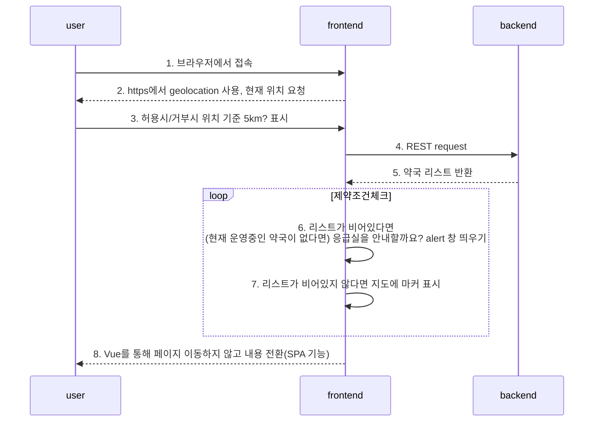

- 기능 2. 마커 클릭시 
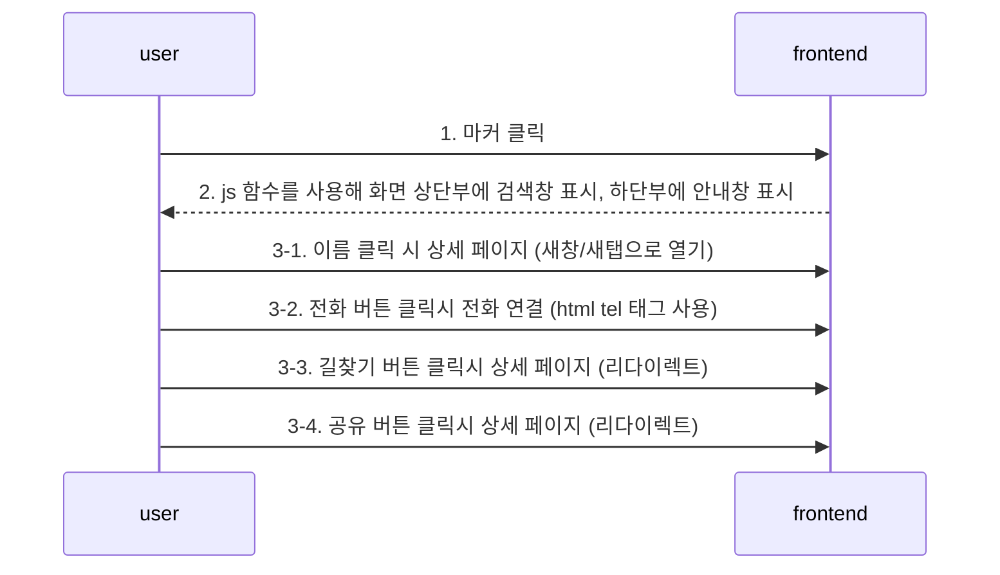

- 기능 3. 주소 검색

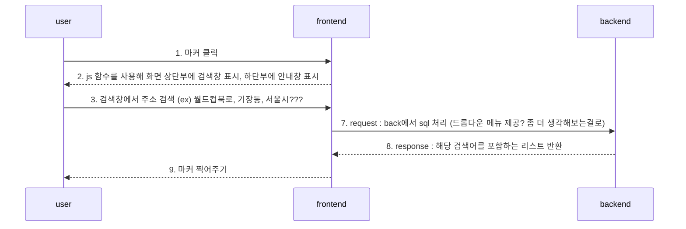
- 기능 4. 메인에서 가장 가까운 약국 안내 기능 (나중에 가능하면 개발)

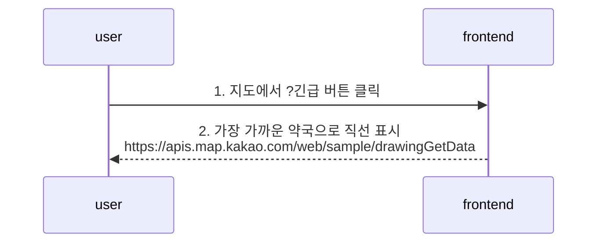

- 기능 5. 비로그인 ip 기반 댓글? 리뷰 기능
- 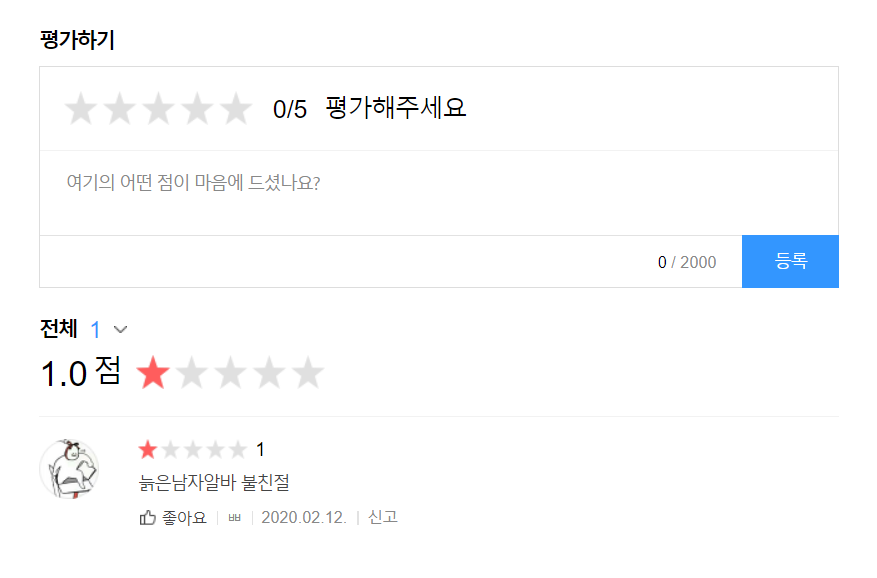

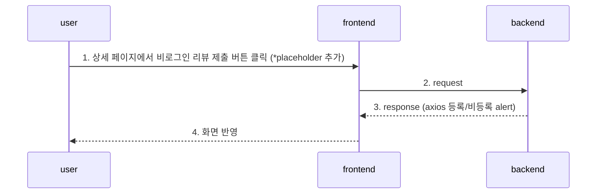

기능 6. 나만의 약국 - 약 리스트 /GET

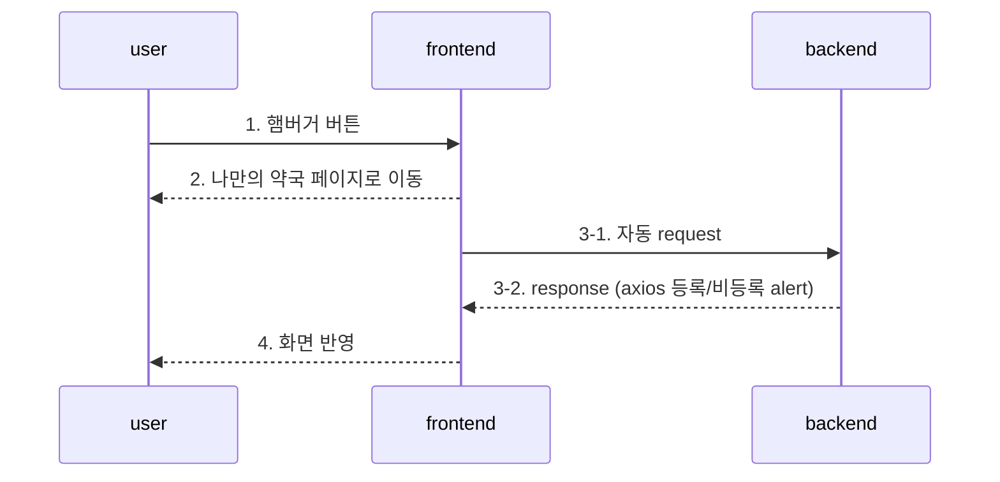

기능 7. 나만의 약국 - 약 등록 /POST

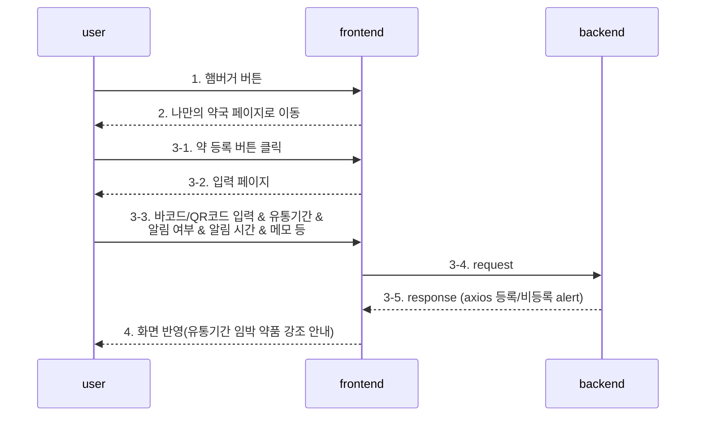

기능 8. 나만의 약국 - 약 개별 CRUD

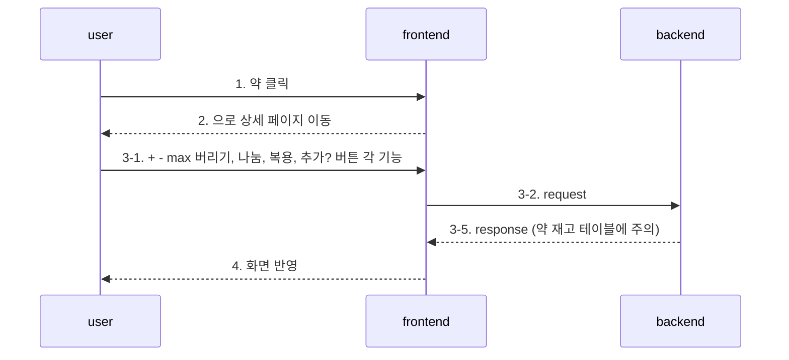

기능 9. 복용 기록(로그) (테이블을 그대로)

```example
복용 로그
2020년 ㅁ월 ㅁ일 9시  || 이지엔 || 2알 || 복용 			재고 8 -> 6
9시 3알 복용 되돌리기					재고 5 -> 8
9시 3알 복용							재고 8 -> 5
3시 2알 복용							재고 10 -> 8
```

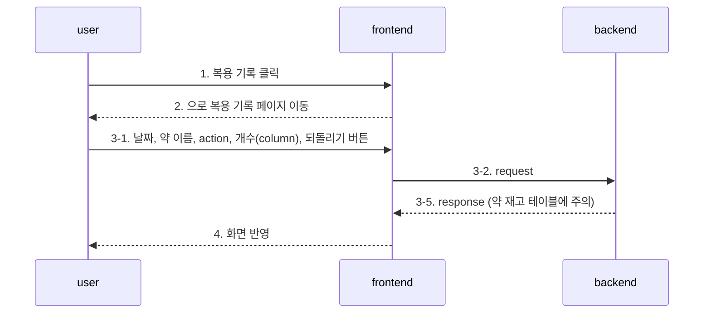

기능 10. 구매, 복용 통계

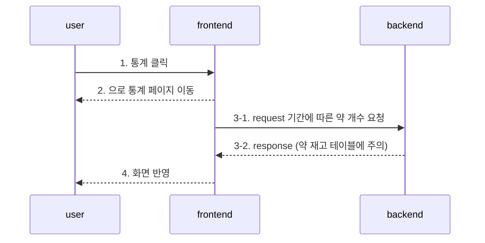
